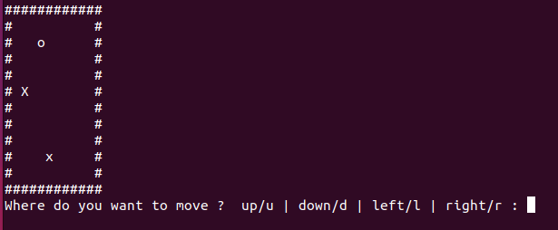

<h1 align="center">📦 Sokoban</h1>

---

<p align="center">
  <a href="#dart-about">About</a> &#xa0; | &#xa0; 
  <a href="#white_check_mark-requirements">Requirements</a> &#xa0; | &#xa0;
  <a href="#checkered_flag-starting">Starting</a> &#xa0;
</p>

---


## 🎯 About ##

Sokoban is a game where you have to place a box in a location by pushing it.

`o` : Player (you)

`X` : The box to move

`x` : Place to place the box to win
  
`#` : Wall
  



To move enter `u` for move up, `d` for move down, `l` for move left and `r` for move right.


## ✅ Requirements ##

Before starting 🏁, you need to have [Git](https://git-scm.com) installed.

## 🏁 Starting ##

```bash
# Clone this project
$ git clone https://github.com/BenoitPrmt/Sokoban

# Access
$ cd Sokoban

# Run the project
$ make all

```

&#xa0;

<a href="#top">Back to top</a>
